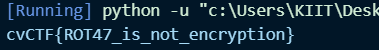

## Write Up

### Problem Overview
The problem involves a piece of Python code that supposedly "encrypts" a credit card number using the ROT47 cipher. Our task is to decode this number to reveal the actual credit card information hidden in the variable bezos_cc_secret.

### Code Analysis
The code provides a decode_secret function that implements the ROT47 cipher. ROT47 is a simple substitution cipher that rotates each character by 47 positions within a specific range of ASCII characters. Interestingly, ROT47 encryption and decryption are the same operations, meaning the same function can be used to encode and decode the text.

```py
bezos_cc_secret = "4Gr%uL#~%cf0:D0?@E06?4CJAE:@?N"
```

This string is the encoded credit card number that we need to decode.

### Decoding Process
1. Understanding ROT47:
    - The cipher operates on a range of characters from the ASCII table, specifically from ! to ~ (ASCII 33 to 126).
    - Each character in the string is shifted 47 positions within this range.

2. Using the Provided Function:
    - The decode_secret function iterates over each character in the string, finds its position in the alphabet, and then shifts it by 47 positions.
    - We can use this function directly to decode bezos_cc_secret.
### Decoded Output
Running the decode_secret function with the bezos_cc_secret string:
```py
decode_secret(bezos_cc_secret)
```

### Result
Upon decoding, the string "4Gr%uL#~%cf0:D0?@E06?4CJAE:@?N" is revealed to be the credit card number:


```
cvCTF{ROT47_is_not_encryption}
```