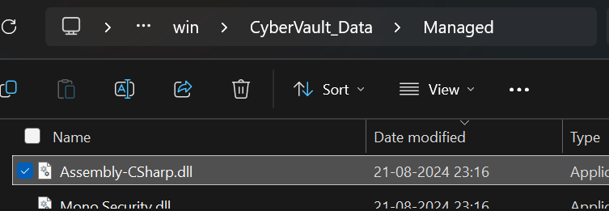
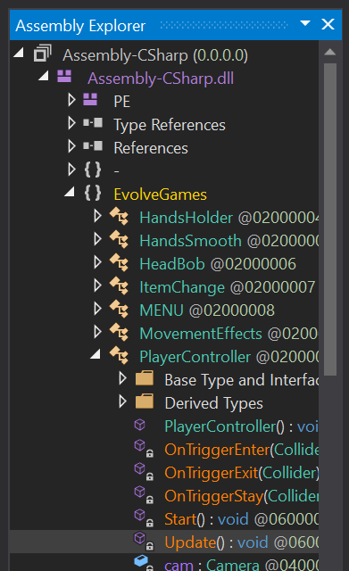
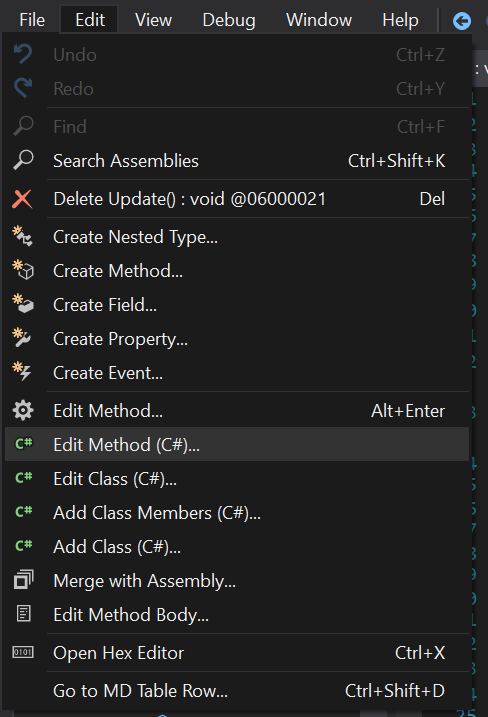
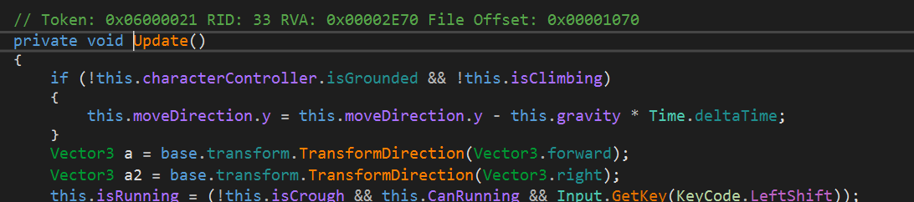
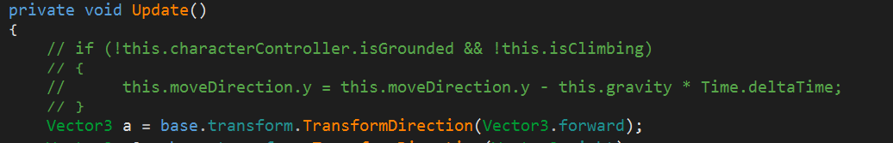
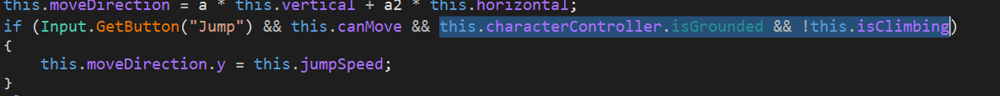
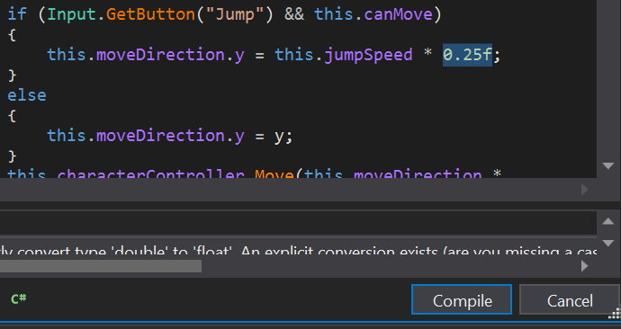
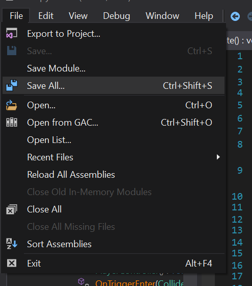
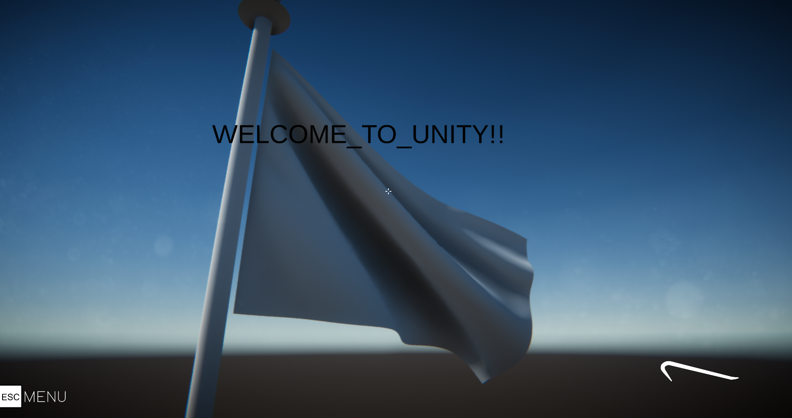

## Write Up

This Game is in Unity, and You need to download [dnSpy](https://github.com/dnSpy/dnSpy) to edit scripts of the game.

Open this file into dnSpy:



Open the `Update` script:



We will edit this script to win the game. Head over to the Edit menu and click on `Edit Method (C#)`:



Here you will see this line of code:



This code checks two conditions:

1. If the character is not grounded (i.e., not on the ground).
2. If the character is not climbing.

If both conditions are true, it applies gravity to the character's vertical movement (moveDirection.y) by decreasing its value over time (Time.deltaTime). This simulates the effect of gravity pulling the character downwards when they are in the air.

Well we dont want gravity :)

So we will comment out this line of code:



Similary here furthur down, we will remove the condition where we are checking if the character is grounded or not or climbing or not, and remove the part (highligted in the image)



Then we will go ahead and compile the code by clicking on the compile button:
Note that i also added a little factor with which we will move so that it is easier for us to reach the flag.


Now save:


Now Run the game, as soon as you jump, you will continue moving upwards (because we disabled gravity :D ).
Make your way towards the flag and you should be able to see the flag:



Now just submit the flag with the format specified:

```
cvCTF{WELCOME_TO_UNITY!!}
```