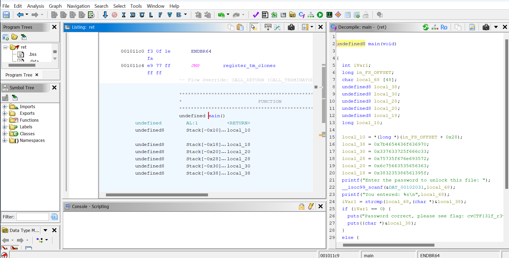
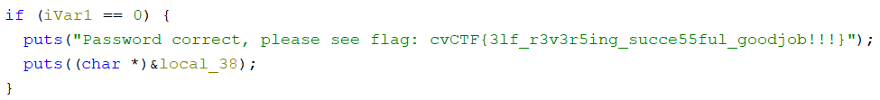
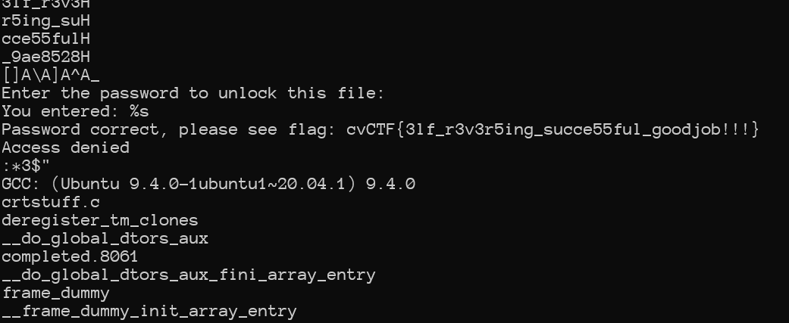
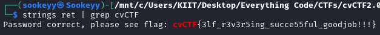

## Write Up

### Approach 1: Using Ghidra
1. Open the ELF file in Ghidra:
    - Load the binary into Ghidra, a reverse engineering tool.
    - Analyze the binary to disassemble and decompile the code.
    - 
2. Locate the main function:
    - In the Functions window, double-click on the main function to view its disassembly.

3. Analyze the main function:
    - Through a quick glance at the decompiled code, you could see that the flag is written in plain sight.
    - 

4. Extract the flag:
    - ```
      cvCTF{3lf_r3v3r5ing_succe55ful_goodjob!!!}
      ```

### Approach 2: Using `strings` command
1. Run the strings Command:
    - Open a terminal and run the strings command on the ELF file to extract printable characters from the binary.
    - The command is as follows: `strings <file name>`
        ``` 
        strings ret
        ```

2. Search for the Password:
    - Look through the output for any strings that resemble a password, especially those that match the format or contain recognizable patterns like words or sequences.
        - 

    - You can also use `grep` with the flag format, i.e. `cvCTF`.

3. Extract the flag:
    - ```
      cvCTF{3lf_r3v3r5ing_succe55ful_goodjob!!!}
      ```